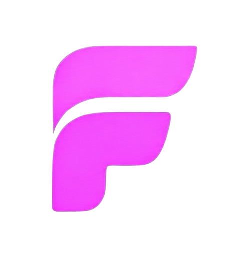
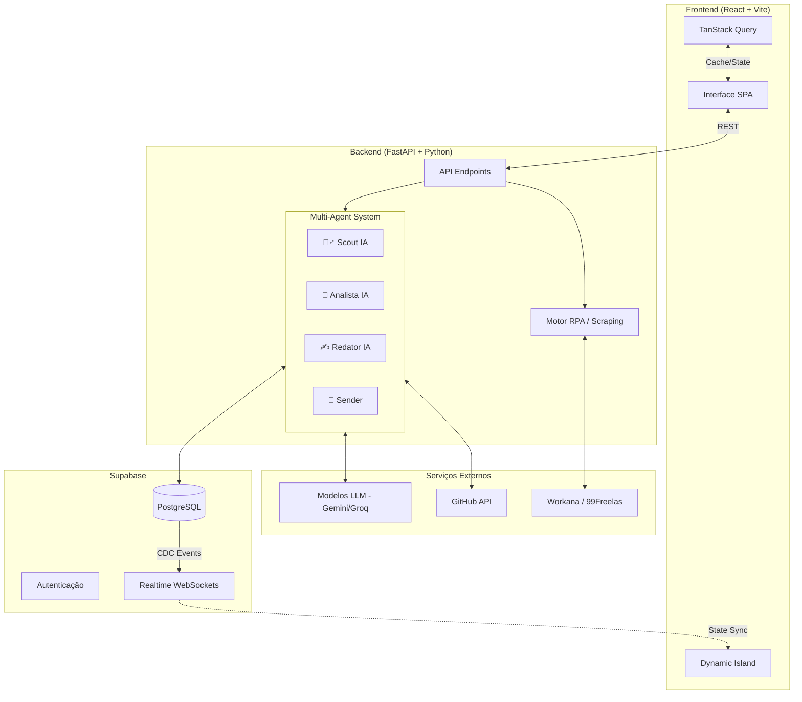

<div align="center">
  <!-- Adicione o logo do projeto aqui -->
  
  
  <h1>FreelaOS</h1>
  <p><strong>O Sistema Operacional e CRM Inteligente para Freelancers</strong></p>

  <p>
    
    
    
    
    
    
  </p>
</div>

---

## 📖 A História por trás do FreelaOS

A ideia do FreelaOS surgiu quando comecei a tentar me aventurar no mundo dos freelas de dev. Diversas plataformas, milhares de concorrentes, projetos novos a cada minuto. Quem chegava por último era praticamente invisível, então pensei: *"Cara, pra eu conseguir um freela eu vou ter ralar muito, ficar o dia inteiro na frente do pc só mandando proposta"*.

Mas, assim como a maioria, eu não tinha todo esse tempo. Foi então que me veio a ideia: *"e se eu automatizar esse processo?"* (bom, quem me conhece sabe, eu tenho um gosto especial por automatizar processos repetitivos). E a partir daí tudo foi se desdobrando: 
- Primeiro fiz o extrator das vagas;
- Depois quis automatizar o fluxo de avaliação e tomada de decisão (foi quando a ideia dos agentes de I.A. surgiu);
- Depois quis automatizar o envio das propostas;
- Depois o monitoramento... 

Quando me dei conta, estava criando **meu próprio CRM para freelancers**.

---

## ⚔️ O Problema vs A Solução

**O Problema (O jeito antigo):**
Freelancers gastam até 40% do seu tempo caçando projetos em plataformas de concorrência acirrada (Workana, 99Freelas). O processo é manual, cansativo e depende de "estar online na hora certa" para ser um dos primeiros a enviar uma proposta.

**A Solução (FreelaOS):**
O FreelaOS atua como uma **equipe comercial autônoma**, trabalhando em *background* 24 horas por dia. Ele monitora vagas, analisa o briefing, cruza com seu portfólio (sincronizado com o Github) e submete propostas sob medida de forma invisível. Você acorda, abre o Inbox e os leads já estão engatilhados.

---

## ✨ Features Principais

- 🕵️‍♂️ **Scout IA (Extrator):** Motor autônomo baseado em Playwright que navega pelas plataformas varrendo novas oportunidades.
- 🧠 **Analista IA:** Inspeciona os requisitos das vagas recém-coletadas e gera um "Score de Compatibilidade" avaliando risco, orçamento e alinhamento tecnológico com suas Stacks.
- ✍️ **Redator IA:** Lê seus repositórios sincronizados do GitHub e gera propostas comerciais altamente persuasivas, humanas e hiper-personalizadas.
- 🚀 **Sender (Robô de Submissão):** Fura a fila enviando propostas automaticamente. Se ativado o modo manual, envia o rascunho pro seu Backlog.
- 🏝️ **Dynamic Island (Live Activity):** Um HUD fluido e responsivo no topo da interface que monitora e exibe a telemetria do motor de extração e dos agentes em tempo real, sincronizado via Supabase Realtime.
- 📊 **CRM Integrado:** Dashboard completo com Kanban para Projetos, gestão de Clientes e Inbox unificado.

---

## 📸 Interface (Sneak Peek)

> *Adicione screenshots da sua aplicação abaixo*

<div align="center">
  
  <br/>
  
</div>

---

## 🏗️ Arquitetura do Sistema

O FreelaOS possui uma arquitetura moderna dividida entre um Frontend ultra reativo em React e um Backend robusto servindo como "cérebro" de automação e scraping.



---

## ⚙️ Como rodar localmente

### Pré-requisitos
- Node.js (v18+)
- Python (3.11+)
- Conta no Supabase
- Chaves de API (Gemini/Groq)

### 1. Backend (O Cérebro)
```bash
# 1. Acesse a raiz do projeto
# 2. Crie o ambiente virtual
python -m venv venv

# 3. Ative o ambiente
# No Linux/Mac:
source venv/bin/activate
# No Windows:
# .\venv\Scripts\activate

# 4. Instale as dependências
pip install -r backend/requirements.txt

# 5. Instale os binários do navegador para o Playwright (Scraping)
playwright install chromium

# 6. Inicie o servidor FastAPI
uvicorn backend.src.main:app --reload
```

### 2. Frontend (A Interface)
```bash
# 1. Acesse o diretório do frontend
cd frontend

# 2. Instale as dependências
npm install

# 3. Inicie o servidor Vite
npm run dev
```

### 3. Variáveis de Ambiente (`.env`)
Você precisará criar um arquivo `.env` na raiz do backend e do frontend conectando ao seu projeto no Supabase:

```env
# Conexão do Supabase (Frontend & Backend)
VITE_SUPABASE_URL=sua_url_aqui
VITE_SUPABASE_ANON_KEY=sua_anon_key_aqui

# Keys Privadas (Backend)
SUPABASE_SERVICE_ROLE_KEY=sua_service_role_key
GEMINI_API_KEY=sua_chave_do_google_aqui
```

---

## 🔒 Segurança de Sessão (Playwright)
O Extrator/Sender do FreelaOS roda simulando um navegador real, operando de forma logada nas plataformas. O estado da sessão (cookies e local storage) é guardado em disco local para evitar banimentos por excesso de logins. **Essas pastas estão no `.gitignore` por questões de segurança e jamais devem ser versionadas.**
